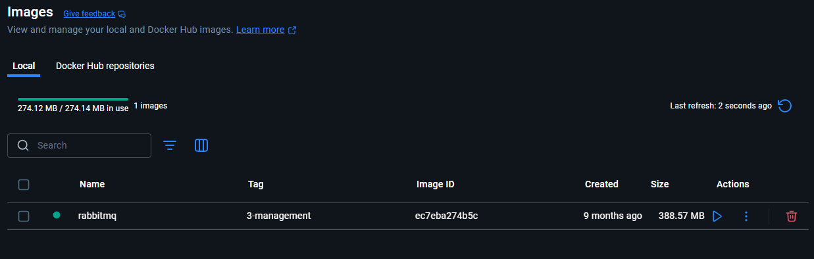
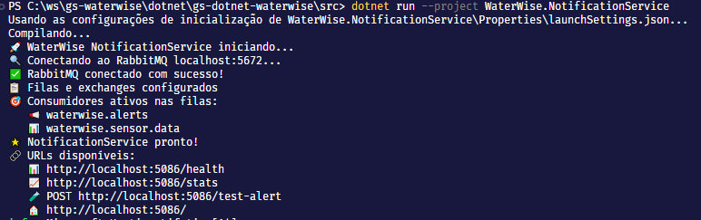
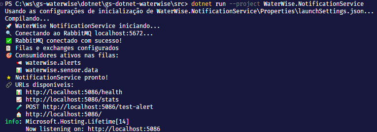
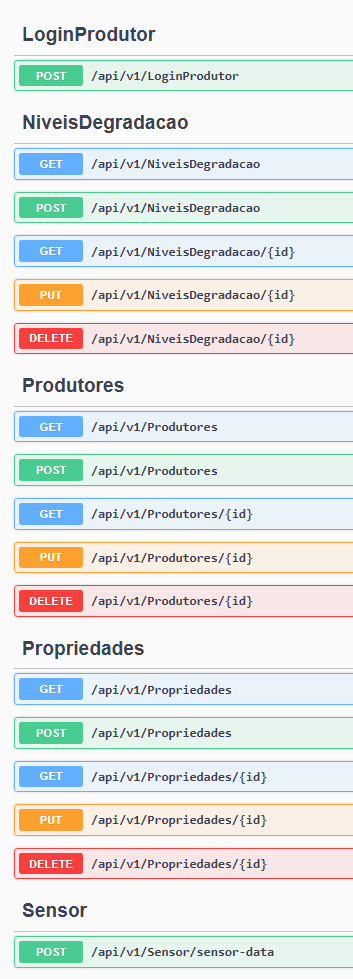
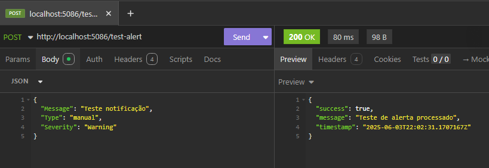
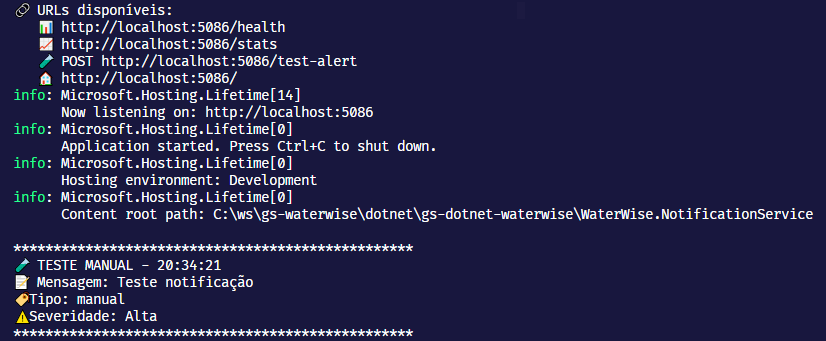
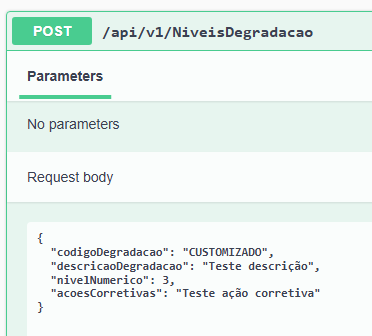
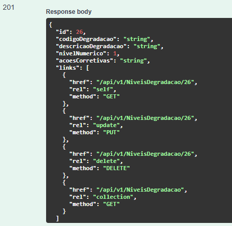
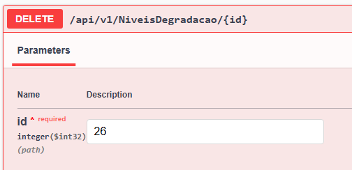
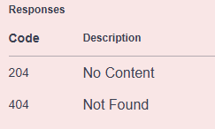

# 🌊 WaterWise API - Sistema IoT para Prevenção de Enchentes

[](https://dotnet.microsoft.com/)
[](https://www.oracle.com/)
[](https://www.rabbitmq.com/)
[](https://dotnet.microsoft.com/apps/machinelearning-ai/ml-dotnet)

## 📋 Descrição do Projeto

O **WaterWise** é um sistema IoT inteligente desenvolvido para a Global Solution 2025 da FIAP, com foco na prevenção de enchentes urbanas através do monitoramento de propriedades rurais. O sistema utiliza sensores IoT para coletar dados em tempo real sobre umidade do solo, temperatura e precipitação, aplicando machine learning para prever riscos de enchentes.

### 🎯 Principais Funcionalidades

- **CRUD Completo**: Gerenciamento de produtores rurais, propriedades e sensores IoT
- **API RESTful**: Implementação com HATEOAS, versionamento e rate limiting
- **Machine Learning**: Predição de riscos de enchente usando ML.NET
- **Microsserviços**: Arquitetura distribuída com RabbitMQ
- **Monitoramento IoT**: Recepção e processamento de dados de sensores em tempo real
- **Sistema de Alertas**: Notificações automáticas baseadas em condições críticas

## 🛠️ Tecnologias Utilizadas

### Backend & API
- **.NET 9.0** - Framework principal
- **ASP.NET Core Web API** - API RESTful
- **Entity Framework Core** - ORM para acesso a dados
- **Oracle Database** - Banco de dados principal

### Machine Learning & IA
- **ML.NET** - Framework de machine learning
- **Algoritmos de Classificação** - Predição de riscos de enchente

### Mensageria & Microsserviços
- **RabbitMQ** - Message broker para comunicação assíncrona
- **Microsserviços** - Arquitetura distribuída (**WaterWise.NotificationService**)

### Qualidade & Testes
- **XUnit** - Framework de testes unitários
- **FluentAssertions** - Biblioteca para assertions mais legíveis
- **Moq** - Framework para mock objects

### Documentação & API Design
- **Swagger/OpenAPI** - Documentação interativa da API
- **HATEOAS** - Hypermedia as the Engine of Application State
- **Rate Limiting** - Controle de taxa de requisições
- **API Versioning** - Versionamento da API

### Observabilidade
- **Serilog** - Framework de logging estruturado
- **Health Checks** - Monitoramento de saúde da aplicação

## 🚀 Como Executar o Projeto

### Pré-requisitos

- **.NET 9.0 SDK** ou superior
- **Oracle Database** (local ou Docker)
- **RabbitMQ** (local ou Docker)
- **Git** para clonagem do repositório

### 1. Configurando o RabbitMQ

O RabbitMQ é essencial para o funcionamento do sistema de mensageria e notificações. Execute o comando abaixo para criar e executar o container:

```bash
docker run -d --name waterwise-rabbitmq \
  -p 5672:5672 \
  -p 15672:15672 \
  -e RABBITMQ_DEFAULT_USER=guest \
  -e RABBITMQ_DEFAULT_PASS=guest \
  rabbitmq:3-management
```

**Verificação da instalação:**
- **Interface de Gerenciamento**: Acesse `http://localhost:15672`
- **Credenciais**: usuário `guest`, senha `guest`
- **Status do Container**: Execute `docker ps` para verificar se está rodando



### 2. Configurando o Banco de Dados Oracle

O projeto está configurado para usar Oracle Database. As configurações estão no `appsettings.json`:

```json
{
  "ConnectionStrings": {
    "OracleConnection": "Data Source=(DESCRIPTION=(ADDRESS_LIST=(ADDRESS=(PROTOCOL=TCP)(HOST=oracle.fiap.com.br)(PORT=1521))) (CONNECT_DATA=(SERVER=DEDICATED)(SID=ORCL)));User Id=rm553528;Password=150592;Connection Timeout=30;"
  }
}
```

**Estrutura das Tabelas:**
O sistema utiliza as seguintes tabelas principais:
- `GS_WW_PRODUTOR_RURAL` - Dados dos produtores
- `GS_WW_PROPRIEDADE_RURAL` - Informações das propriedades
- `GS_WW_SENSOR_IOT` - Configuração dos sensores
- `GS_WW_LEITURA_SENSOR` - Dados coletados pelos sensores
- `GS_WW_NIVEL_DEGRADACAO_SOLO` - Níveis de degradação do solo

### 3. Clonando e Executando o Projeto

```bash
# Clone o repositório
git clone https://github.com/seu-usuario/waterwise-api.git

# Navegue para o diretório src
cd waterwise-api/src
```

### 4. Executando a API Principal

Abra um terminal na pasta `src` e execute:

```bash
dotnet watch run --project WaterWise.API
```

**Resultado esperado:**
```
🌊 WaterWise API iniciada com sucesso!
📍 Swagger UI: http://localhost:5072
🔗 Health check: http://localhost:5072/health
📊 Database status: http://localhost:5072/api/database/status
```



### 5. Executando o Microserviço de Notificação

Abra **outro terminal** na pasta `src` e execute:

```bash
dotnet watch run --project WaterWise.NotificationService
```

**Resultado esperado:**
```
🚀 WaterWise NotificationService iniciando...
✅ RabbitMQ conectado com sucesso!
🌟 NotificationService pronto!
🔗 URLs disponíveis:
   📊 http://localhost:5086/health
   📈 http://localhost:5086/stats
   🧪 POST http://localhost:5086/test-alert
```



## 📡 Endpoints Disponíveis

Com ambos os projetos rodando, acesse a documentação Swagger em `http://localhost:5072/index.html`:



### Principais Endpoints:

#### 🧑‍🌾 Produtores Rurais
- `GET /api/v1/produtores` - Listar produtores (paginado)
- `POST /api/v1/produtores` - Criar novo produtor
- `GET /api/v1/produtores/{id}` - Obter produtor por ID
- `PUT /api/v1/produtores/{id}` - Atualizar produtor
- `DELETE /api/v1/produtores/{id}` - Excluir produtor

#### 🏡 Propriedades Rurais
- `GET /api/v1/propriedades` - Listar propriedades (com predição ML)
- `POST /api/v1/propriedades` - Criar nova propriedade
- `GET /api/v1/propriedades/{id}` - Obter propriedade por ID
- `PUT /api/v1/propriedades/{id}` - Atualizar propriedade
- `DELETE /api/v1/propriedades/{id}` - Excluir propriedade (cascade)

#### 🌱 Níveis de Degradação do Solo
- `GET /api/v1/niveisdegradacao` - Listar níveis de degradação
- `POST /api/v1/niveisdegradacao` - Criar novo nível
- `PUT /api/v1/niveisdegradacao/{id}` - Atualizar nível
- `DELETE /api/v1/niveisdegradacao/{id}` - Excluir nível

#### 🔐 Autenticação
- `POST /api/v1/loginprodutor` - Login de produtor rural

#### 📊 Dados IoT
- `POST /api/v1/sensor/sensor-data` - Receber dados de sensores IoT

### DTOs e Schemas

O Swagger também mostra todos os DTOs utilizados:


## 🧪 Testando o Sistema

### 1. Teste de Notificação Manual

Envie uma requisição POST para `http://localhost:5086/test-alert` com o seguinte JSON:

```json
{
  "Message": "Teste notificação manual",
  "Type": "manual", 
  "Severity": "Alta"
}
```

**Usando curl:**
```bash
curl -X POST http://localhost:5086/test-alert \
  -H "Content-Type: application/json" \
  -d '{"Message": "Teste notificação", "Type": "manual", "Severity": "Alta"}'
```

**Exemplo no Insomnia/Postman:**



**Resultado no console do NotificationService:**



### 2. Teste de Dados de Sensor

Para simular dados IoT, envie uma requisição POST para `/api/v1/sensor/sensor-data`:

```json
{
  "idSensor": 1,
  "umidadeSolo": 25.5,
  "temperaturaAr": 32.0,
  "precipitacaoMm": 75.0
}
```

**Alertas Automáticos:**
O sistema gerará alertas automaticamente se:
- Umidade do solo < 20% (UMIDADE_CRITICA)
- Precipitação > 50mm/h (PRECIPITACAO_INTENSA)

### 3. Exemplo com Outras Requisições

Esta seção demonstra o uso prático dos principais endpoints da API WaterWise, mostrando exemplos reais de requisições e suas respectivas respostas.

#### 📝 3.1. POST: Criar Nível de Degradação

**Endpoint:** `POST /api/v1/niveisdegradacao`

**Corpo da Requisição:**
```json
{
  "codigoDegradacao": "string",
  "descricaoDegradacao": "string",
  "nivelNumerico": 1,
  "acoesCorretivas": "string"
}
```

**Response Esperado (201 Created):**
```json
{
  "id": 26,
  "codigoDegradacao": "CUSTOMIZADO",
  "descricaoDegradacao": "teste desc",
  "nivelNumerico": 5,
  "acoesCorretivas": "teste ações",
  "links": [
    {
      "href": "/api/v1/NiveisDegradacao/25",
      "rel": "self",
      "method": "GET"
    },
    {
      "href": "/api/v1/NiveisDegradacao/25",
      "rel": "update",
      "method": "PUT"
    },
    {
      "href": "/api/v1/NiveisDegradacao/25",
      "rel": "delete",
      "method": "DELETE"
    },
    {
      "href": "/api/v1/NiveisDegradacao",
      "rel": "collection",
      "method": "GET"
    }
  ]
}
```

**Prints da Requisição:**



---

#### 🗑️ 3.2. DELETE: Excluir Nível de Degradação

Neste endpoint vamos deletar o Nivel degradação que acabamos de criar (de id 26).

**Endpoint:** `DELETE /api/v1/niveisdegradacao/6`

**Corpo da Requisição:** Nenhum (apenas o ID na URL)

**Response Esperado (204 No Content):**
```
Status: 204 No Content
Body: (vazio)
```

**Exemplo de Response de Erro (400 Bad Request) - se houver dependências:**
```json
{
  "error": "Nível de degradação com ID 6 possui 2 propriedades associadas. Exclua as propriedades primeiro."
}
```

**Prints da Requisição:**



---

#### ✏️ 3.3. PUT: Atualizar Produtor Rural

**Endpoint:** `PUT /api/v1/produtores/1`

**Corpo da Requisição:**
```json
{
  "id": 1,
  "nomeCompleto": "João Silva Santos (Atualizado)",
  "email": "joao.silva.novo@email.com",
  "telefone": "(11) 98888-7777",
  "cpfCnpj": "123.456.789-00",
  "senha": "novaSenha123"
}
```

**Response Esperado (200 OK):**
```json
{
  "id": 1,
  "nomeCompleto": "João Silva Santos (Atualizado)",
  "email": "joao.silva.novo@email.com",
  "telefone": "(11) 98888-7777",
  "cpfCnpj": "123.456.789-00",
  "links": [
    {
      "href": "/api/v1/produtores/1",
      "rel": "self",
      "method": "GET"
    },
    {
      "href": "/api/v1/produtores/1",
      "rel": "update",
      "method": "PUT"
    },
    {
      "href": "/api/v1/produtores/1",
      "rel": "delete",
      "method": "DELETE"
    },
    {
      "href": "/api/v1/produtores",
      "rel": "collection",
      "method": "GET"
    }
  ]
}
```

**Print da Requisição:**
```
[Espaço reservado para print da atualização do produtor]
```

---

#### 🔍 3.4. GET: Recuperar Produtor por ID

**Endpoint:** `GET /api/v1/produtores/1`

**Corpo da Requisição:** Nenhum

**Response Esperado (200 OK):**
```json
{
  "id": 1,
  "nomeCompleto": "João Silva Santos (Atualizado)",
  "email": "joao.silva.novo@email.com",
  "telefone": "(11) 98888-7777",
  "cpfCnpj": "123.456.789-00",
  "links": [
    {
      "href": "/api/v1/produtores/1",
      "rel": "self",
      "method": "GET"
    },
    {
      "href": "/api/v1/produtores/1",
      "rel": "update",
      "method": "PUT"
    },
    {
      "href": "/api/v1/produtores/1",
      "rel": "delete",
      "method": "DELETE"
    },
    {
      "href": "/api/v1/produtores",
      "rel": "collection",
      "method": "GET"
    }
  ]
}
```

**Print da Requisição:**
```
[Espaço reservado para print da recuperação do produtor por ID]
```

---

#### 🏡 3.5. GET: Listar Todas as Propriedades

**Endpoint:** `GET /api/v1/propriedades?page=1&pageSize=5`

**Corpo da Requisição:** Nenhum

**Parâmetros de Query Importantes:**
- `page`: Número da página (padrão: 1)
- `pageSize`: Quantidade de itens por página (padrão: 10, máximo recomendado: 50)

**Response Esperado (200 OK):**
```json
{
  "items": [
    {
      "id": 1,
      "nomePropriedade": "Fazenda São João",
      "latitude": -23.5505,
      "longitude": -46.6333,
      "areaHectares": 150.5,
      "nomeProdutor": "João Silva Santos (Atualizado)",
      "emailProdutor": "joao.silva.novo@email.com",
      "nivelDegradacao": "Solo em bom estado",
      "nivelNumerico": 2,
      "riscoEnchente": 0.23,
      "sensores": [
        {
          "id": 1,
          "tipoSensor": "UMIDADE_SOLO",
          "modeloDispositivo": "ESP32-SOIL-001",
          "dataInstalacao": "2025-01-15T10:30:00",
          "ultimaLeitura": {
            "timestampLeitura": "2025-06-08T14:25:00",
            "umidadeSolo": 45.5,
            "temperaturaAr": 25.0,
            "precipitacaoMm": 5.0
          }
        }
      ],
      "links": [
        {
          "href": "/api/v1/propriedades/1",
          "rel": "self",
          "method": "GET"
        },
        {
          "href": "/api/v1/propriedades/1",
          "rel": "update",
          "method": "PUT"
        },
        {
          "href": "/api/v1/propriedades/1",
          "rel": "delete",
          "method": "DELETE"
        },
        {
          "href": "/api/v1/propriedades",
          "rel": "collection",
          "method": "GET"
        }
      ]
    }
  ],
  "page": 1,
  "pageSize": 5,
  "totalItems": 3,
  "totalPages": 1,
  "links": [
    {
      "href": "/api/v1/propriedades?page=1&pageSize=5",
      "rel": "first",
      "method": "GET"
    },
    {
      "href": "/api/v1/propriedades?page=1&pageSize=5",
      "rel": "last",
      "method": "GET"
    }
  ]
}
```

**🔗 Importância do HATEOAS neste Endpoint:**

O endpoint de propriedades é um **excelente exemplo** da implementação HATEOAS (Hypermedia as the Engine of Application State) no WaterWise:

1. **Navegação Descobrível**: Cada propriedade inclui links para todas as ações possíveis:
   - `self`: Link para obter os detalhes completos da propriedade
   - `update`: Link para atualizar a propriedade
   - `delete`: Link para excluir a propriedade
   - `collection`: Link para voltar à listagem de propriedades

2. **Paginação Inteligente**: A resposta inclui links de navegação entre páginas:
   - `first`: Primeira página
   - `previous`: Página anterior (quando aplicável)
   - `next`: Próxima página (quando aplicável)
   - `last`: Última página

3. **Facilita Integração**: Clientes da API não precisam construir URLs manualmente - podem seguir os links fornecidos

**📊 Customização de Paginação:**

O endpoint suporta customização flexível através de parâmetros:

```bash
# Listar apenas 3 propriedades por página
GET /api/v1/propriedades?pageSize=3

# Navegar para a página 2 com 10 itens
GET /api/v1/propriedades?page=2&pageSize=10

# Obter todas (até 50 itens) em uma página
GET /api/v1/propriedades?pageSize=50
```

**⚡ Benefícios da Paginação:**
- **Performance**: Reduz carga no servidor e tempo de resposta
- **Experiência do Usuário**: Carregamento mais rápido em interfaces
- **Flexibilidade**: Permite ajustar quantidade conforme necessidade
- **Machine Learning**: Inclui predições de risco de enchente para cada propriedade

**Print da Requisição:**
```
[Espaço reservado para print da listagem de propriedades com paginação]
```

---

### 4. Verificação de Status

**Health Check da API:**
```bash
curl http://localhost:5072/health
```

**Status do Banco de Dados:**
```bash
curl http://localhost:5072/api/database/status
```

**Estatísticas do NotificationService:**
```bash
curl http://localhost:5086/stats
```

## 🤖 Machine Learning

O sistema inclui predição de risco de enchente usando ML.NET:

### Características do Modelo:
- **Algoritmo**: Regressão Logística (SdcaLogisticRegression)
- **Features**: Umidade do solo, temperatura, precipitação, área e nível de degradação
- **Output**: Probabilidade de risco de enchente (0.0 - 1.0)

### Treinamento Automático:
O modelo é treinado automaticamente na inicialização da API com dados sintéticos baseados em:
- Alta precipitação + baixa umidade + alto nível de degradação = Alto risco
- Baixa precipitação + alta umidade + baixo nível de degradação = Baixo risco

### Visualização da Predição:
As predições aparecem no campo `riscoEnchente` ao consultar propriedades:

```json
{
  "id": 1,
  "nomePropriedade": "Fazenda São João",
  "riscoEnchente": 0.75,
  "sensores": [...],
  "links": [...]
}
```

## 🔧 Configurações Avançadas

### Rate Limiting

O sistema implementa rate limiting para proteger a API:

```json
{
  "GeneralRules": [
    {
      "Endpoint": "*",
      "Period": "1m", 
      "Limit": 100
    },
    {
      "Endpoint": "*/sensor-data",
      "Period": "1s",
      "Limit": 10
    }
  ]
}
```

### HATEOAS (Hypermedia)

Todas as respostas incluem links de navegação:

```json
{
  "id": 1,
  "nomeCompleto": "João Silva",
  "links": [
    {
      "href": "/api/v1/produtores/1",
      "rel": "self",
      "method": "GET"
    },
    {
      "href": "/api/v1/produtores/1", 
      "rel": "update",
      "method": "PUT"
    }
  ]
}
```

### Versionamento da API

A API suporta versionamento através de:
- URL: `/api/v1/produtores`
- Query String: `/api/produtores?version=1.0`
- Header: `X-Version: 1.0`

## 🧪 Executando Testes

### Testes Unitários:
```bash
dotnet test
```

### Testes de Integração:
```bash
dotnet test --filter "Category=Integration"
```

### Coverage Report:
```bash
dotnet test --collect:"XPlat Code Coverage"
```

## 📊 Monitoramento e Observabilidade

### Logs Estruturados (Serilog):
```
[2025-06-08 10:30:15] INFO - 🌊 WaterWise API iniciada com sucesso!
[2025-06-08 10:30:16] INFO - ✅ Conexão com Oracle Database estabelecida
[2025-06-08 10:30:17] INFO - ✅ Modelo ML.NET inicializado com sucesso
```

### Health Checks:
- `/health` - Status geral da aplicação
- `/api/database/status` - Status da conexão com o banco
- `http://localhost:5086/health` - Status do NotificationService

### Métricas RabbitMQ:
Acesse `http://localhost:15672` para monitorar:
- Filas ativas
- Mensagens processadas
- Conexões ativas
- Throughput

## 🔒 Segurança

### Implementações de Segurança:
- **Rate Limiting**: Proteção contra ataques DDoS
- **Validação de Entrada**: Validação rigorosa de DTOs
- **Transações**: Operações de banco com rollback automático
- **Logs de Segurança**: Monitoramento de tentativas de login

### Tratamento de Erros:
```json
{
  "error": "Dados de entrada inválidos",
  "details": [
    "O campo NomeCompleto é obrigatório",
    "O email deve ter um formato válido"
  ],
  "timestamp": "2025-06-08T10:30:15Z"
}
```

## 🚀 Deploy e Produção

### Variáveis de Ambiente:
```bash
ASPNETCORE_ENVIRONMENT=Production
ORACLE_CONNECTION_STRING=...
RABBITMQ_HOST=...
ML_MODEL_PATH=...
```

### Docker Support:
```dockerfile
FROM mcr.microsoft.com/dotnet/aspnet:9.0 AS base
WORKDIR /app
EXPOSE 80

FROM mcr.microsoft.com/dotnet/sdk:9.0 AS build
WORKDIR /src
COPY ["WaterWise.API/WaterWise.API.csproj", "WaterWise.API/"]
RUN dotnet restore "WaterWise.API/WaterWise.API.csproj"
```

## 👥 Contribuição

1. Fork o projeto
2. Crie uma branch para sua feature (`git checkout -b feature/nova-funcionalidade`)
3. Commit suas mudanças (`git commit -am 'Adiciona nova funcionalidade'`)
4. Push para a branch (`git push origin feature/nova-funcionalidade`)
5. Abra um Pull Request

## 📄 Licença

Este projeto está licenciado sob a MIT License - veja o arquivo [LICENSE.md](LICENSE.md) para detalhes.

## 🆘 Troubleshooting

### Problemas Comuns:

**1. Erro de conexão com Oracle:**
```
⚠️ Não foi possível conectar ao Oracle Database
```
- Verifique as credenciais no `appsettings.json`
- Confirme se o Oracle Database está acessível
- Teste a conectividade: `curl http://localhost:5072/api/database/status`

**2. RabbitMQ não conecta:**
```
⚠️ Erro ao conectar RabbitMQ
```
- Verifique se o container está rodando: `docker ps`
- Reinicie o container: `docker restart waterwise-rabbitmq`
- Verifique a porta 5672: `telnet localhost 5672`

**3. Modelo ML não carrega:**
```
⚠️ Erro na inicialização do ML
```
- Verifique se o diretório `Assets` existe
- Execute o treinamento manual: `POST /api/v1/ml/train`

**4. Erro 429 (Rate Limit):**
- Aguarde 1 minuto antes de tentar novamente
- Para desenvolvimento, ajuste o `RateLimit` no `appsettings.json`

### Logs Detalhados:
Para debugging, ative logs detalhados no `appsettings.Development.json`:
```json
{
  "Logging": {
    "LogLevel": {
      "Default": "Debug",
      "Microsoft.EntityFrameworkCore": "Information"
    }
  }
}
```
